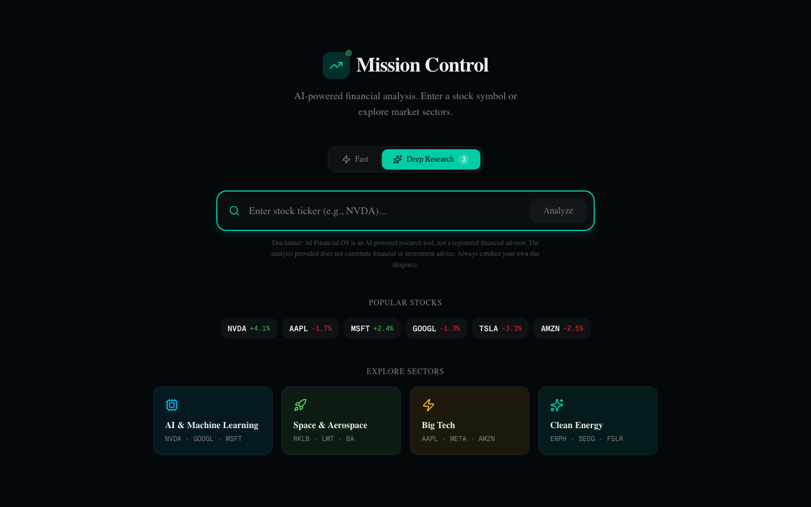
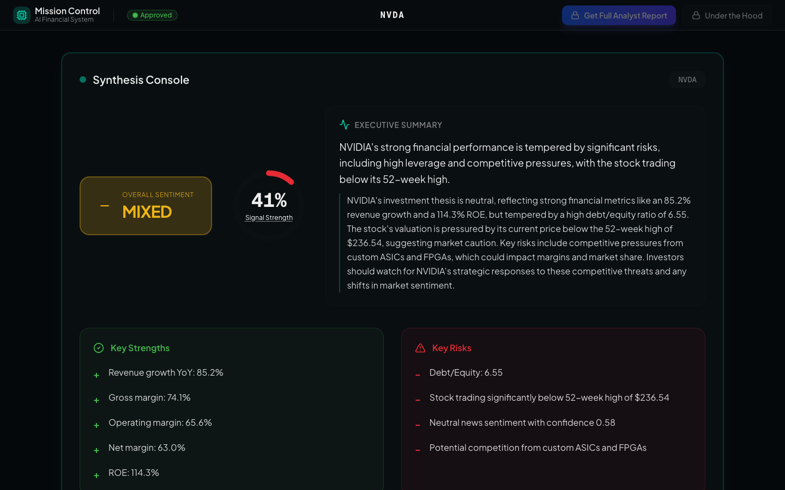
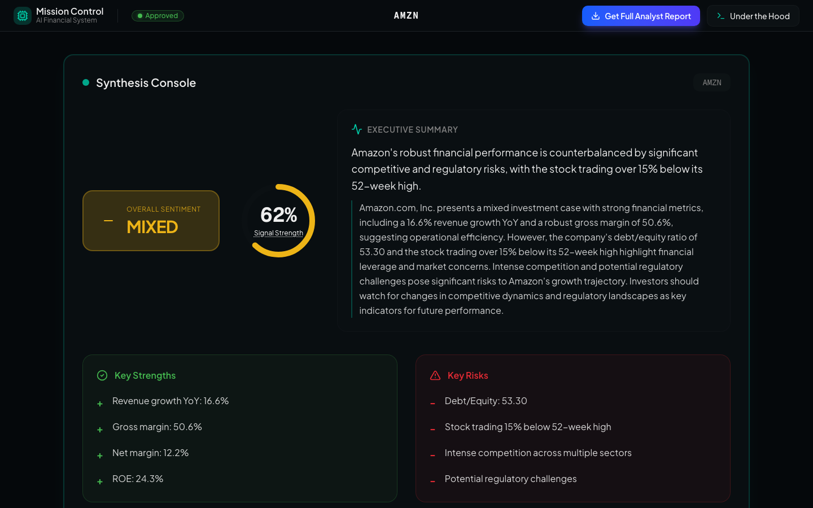
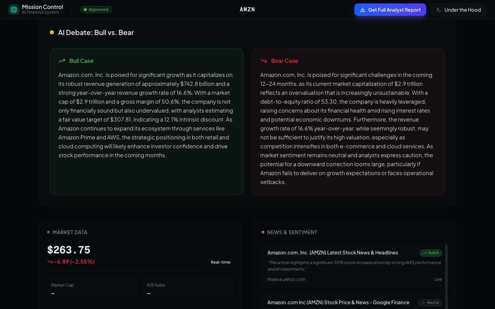
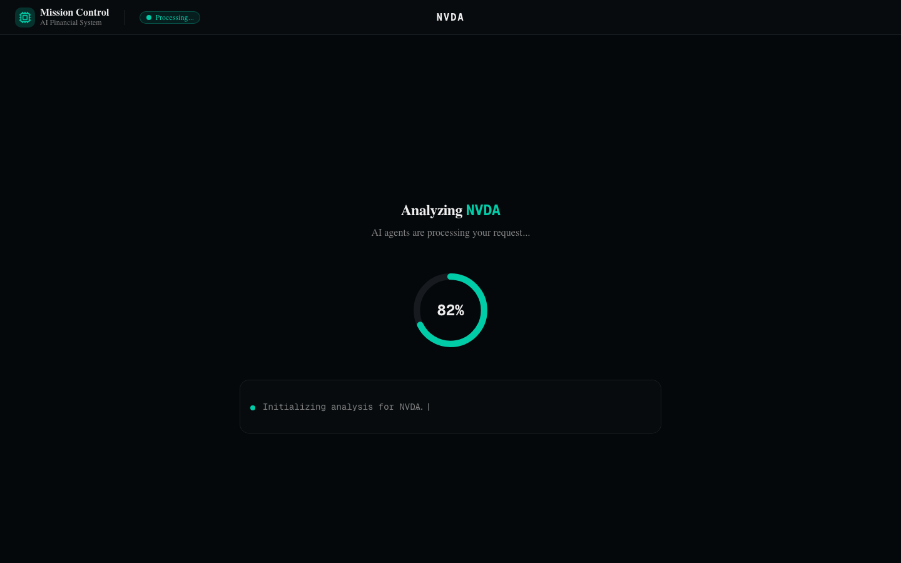

<div align="center">

# Mission Control

### Institutional-grade AI stock research, powered by adversarial multi-agent debate

🚀 **[Live Demo](https://frontend-seven-swart-31.vercel.app)** &nbsp;·&nbsp; 📖 **[Architecture Deep Dive](#technical-architecture)**



[](https://nextjs.org)
[](https://react.dev)
[](https://www.typescriptlang.org)
[](https://tailwindcss.com)
[](https://fastapi.tiangolo.com)
[](https://www.python.org)
[](https://langchain-ai.github.io/langgraph)
[](https://openai.com)
[](https://supabase.com)

</div>

---

## What is Mission Control?

Most "AI stock analysis" tools are thin wrappers around a single LLM call: ticker in, paragraph out. Hallucinations slip through unchecked, sentiment is editorial, and the output reads like a horoscope.

**Mission Control treats stock research as a *multi-agent adversarial process*.** A specialist Bull and Bear agent argue the case in parallel. A Manager Agent synthesizes the strongest points into a balanced thesis. A Critic Agent audits the synthesis for factual grounding, contradictions, and unsupported claims — and forces revisions when it finds them. The result is an institutional-quality report grounded in real SEC filings, earnings call transcripts, live market data, and news sentiment.

Two modes serve different needs:

| Mode | Time | Pipeline | Output |
|------|------|----------|--------|
| **Fast** | ~5 s | Data + Sentiment + Manager | One-line view, key strengths/risks, sentiment snapshot |
| **Deep** | ~30-50 s | Full multi-agent pipeline with debate, SEC, transcripts, critic loop | Bull vs. Bear narrative, executive summary, management tone analysis, exportable PDF |

### Fast Mode — Results in ~5s


*Synthesis Console with overall sentiment, signal strength, executive summary, key strengths & risks.*

### Deep Mode — Full Institutional Analysis


*Deep mode adds real-time market data, news sentiment panel, and the full multi-agent pipeline output.*


*Bull Agent and Bear Agent argue the thesis in parallel — Manager synthesises, Critic audits.*

### Loading — Live Agent Progress


*Real-time progress display with weighted asymptotic progress bar. Never stalls at 90%.*

---

## Why this project is interesting

Beyond the AI features, Mission Control is an exercise in **production-grade UX engineering on top of a fundamentally slow backend**. Generating an institutional report takes 30–50 seconds of real LLM time. Turning that into a premium experience required:

- A **streaming SSE pipeline** so users see agent progress in real time, not a static spinner
- **Weighted asymptotic progress bars** that pace the visible % to the *actual work being done*, killing the "90% syndrome" stall
- **Stale-while-revalidate caching** so repeat searches return in seconds with live price overlays
- **Mid-stream connection recovery** — if the SSE drops, the UI presents a "Try Again" card rather than hanging
- A **calibrated "Labor Illusion" floor** ensuring premium pacing without misleading users
- **Multi-layer LLM output sanitization** — prompt rules + Pydantic schema constraints + post-process regex — because prompts alone don't stop formatting bleed

---

## Technical Architecture


### The multi-agent LangGraph pipeline

```
                                      ┌─── DataAgent (yfinance) ─────┐
                                      ├─── SentimentAgent (Tavily) ──┤
START ──> [parallel fan-out] ────────►├─── FilingsAgent (EDGAR 10-K) ┤──► DebateNode
                                      └─── TranscriptAgent (FMP) ────┘        │
                                                                              │
                                  ┌───── BullAgent ─────┐                     │
                  [parallel] ─────┤                     ├────► ManagerAgent ──┤
                                  └───── BearAgent ─────┘            ▲       │
                                                                     │       │
                                                                     │   CriticAgent
                                                                     │       │
                                                                  needs_revision
                                                                     │       │
                                                                     │   (≤ 2 cycles)
                                                                     │       ▼
                                                                              END
```

Each node is a **typed Pydantic state transition**. The Critic can demand revisions; the Manager re-synthesizes with the Critic's specific instruction prepended to the prompt; the loop terminates at `approved` or after `MAX_REVISION_CYCLES`.

### Streaming architecture (Server-Sent Events)

The Deep pipeline doesn't *wait* and *return* — it **streams agent-level progress events** as they happen. The frontend listens for typed events and renders an "Under the Hood" agent terminal in real time.

```typescript
fetchEventSource("/api/analyze/AAPL/stream", {
  headers: { "X-Master-Code": code },        // header auth, not query param
  onmessage(ev) {
    if (ev.event === "progress") { /* stage update */ }
    if (ev.event === "result")   { /* final FinalReport */ }
  },
  onerror() { /* triggers premium recovery card */ },
});
```

**Why not native `EventSource`?** Because it cannot set custom headers, forcing the master code into a `?query_param=` that leaks into nginx access logs, browser history, and proxy caches. We use `@microsoft/fetch-event-source` to keep auth in headers where it belongs.

**Connection recovery:** the stream tracks a `cleanlyFinished` flag. If the connection closes before the final `result` event arrives, the user lands on a premium recovery card with a one-click **Try Again** button that re-runs the exact same ticker via a retry-nonce in the React effect deps.

### UX engineering — three solved problems

**1. The 90% syndrome (and 100% hang).** A typical AI tool's progress bar races to 90% in 6 seconds, then stalls for 25 seconds while the heavy LLM agents actually run. We solved this with a **weighted phase-based asymptotic progress system**:

```typescript
// Each stage contributes a weight when its event arrives
const STAGE_WEIGHTS = {
  data_complete: 5, sentiment_complete: 5,
  filings_complete: 5, transcript_complete: 5,    // 20% — fast phase
  debate_complete: 40,                            // 40% — heavy LLM
  approved: 40,                                   // 40% — manager + critic
};

// Between milestones, the bar creeps asymptotically toward the phase ceiling
target = locked + remainingInPhase × (1 - e^(-elapsed/τ)) × 0.95
```

And critically: **the bar never reaches 100% inside the component.** The PROCESSING_CAP is 99%. The 100% moment is implicit in the unmount transition when the dashboard renders — preventing a smug 100% bar from sitting there while the user waits.

**2. Stale-while-revalidate caching.** A previously analyzed ticker is served from Supabase **with a live delta refresh** running in parallel. The expensive Critic narrative, bull/bear cases, and SEC analysis are reused (they don't change in hours). Only the price quote and recent news sentiment are re-fetched. Result: a "cached" Deep search returns in ~2 seconds of real backend work.

**3. The Labor Illusion — calibrated, not fake.** Premium products can't return institutional research in 3 seconds and still feel substantial. We enforce a **20-second minimum display floor** for every Deep search, cached or fresh:

```typescript
// reveal happens at max(realBackendTime, 20s)
const reveal = elapsedSinceStart >= FLOOR_MS && reportRef.current !== null
```

The floor is non-binding when real backend > 20s (the user just waits for the real work). For cached searches (~2s real), the bar paces over the full 20s window via a separate "floor pacing" curve — `target = min(weightedTarget, floorTarget)` — so the user sees momentum throughout instead of a 99% stall.

### Multi-layer LLM output defense

LLM output is treated as adversarial. The defense stack:

1. **Prompt level** — structural rules (`Section Separation`, `Anti-Contradiction Guardrail`, `Future-Facing Mandate`) inside the Manager's `SYSTEM_PROMPT`
2. **Schema level** — Pydantic `Field(description=...)` flows into `with_structured_output(method="json_mode")`, so drift surfaces as `ValidationError` not silent corruption
3. **Post-processing level** — `app/utils/sanitize.py` strips trailing bullet bleed from prose-only fields at two layers (debate agents + FinalReport assembly), handles Unicode dashes and quote-peeling
4. **Schema-level eradication** — when prompts alone failed to keep `key_arguments` lists out of narrative fields, we removed the field from the model entirely

### Production hardening

- **Tenacity retries** on every LLM call (3 attempts, exponential 2-10s backoff, retries only `openai.APIConnectionError`/`RateLimitError`/`InternalServerError`/`httpx.ConnectError`/`ReadTimeout` — not ValidationError)
- **Thread join timeouts** on every parallel agent (45s deadline; `queue.get(timeout=...)` for actual deadlock prevention, defensive `join(timeout=5)` for cleanup)
- **Request ID middleware** (`asgi-correlation-id`) — every log line carries `[correlation_id]`, every response carries `X-Request-ID`
- **Structured error logging** — every `except Exception` block uses `log.exception()` to capture full tracebacks
- **Per-IP rate limiting** via slowapi (5/min on `/analyze`, 3/min on `/export`, 10/min on `/auth/ping`)
- **Header-only master code auth** — `X-Master-Code` header is the only accepted source; query-param fallback removed for log hygiene

---

## Tech Stack

### Frontend
- **[Next.js 16](https://nextjs.org)** (App Router, React Server Components)
- **[React 19](https://react.dev)** + **[TypeScript 5](https://www.typescriptlang.org)**
- **[Tailwind CSS 4](https://tailwindcss.com)** + **[shadcn/ui](https://ui.shadcn.com)** primitives
- **[Plus Jakarta Sans](https://fonts.google.com/specimen/Plus+Jakarta+Sans)** (results) + **[Geist](https://vercel.com/font)** (UI chrome) via `next/font`
- **[@microsoft/fetch-event-source](https://github.com/Azure/fetch-event-source)** for header-authenticated SSE
- **[Lucide](https://lucide.dev)** icons, **[Recharts](https://recharts.org)** charts

### Backend
- **[FastAPI 0.136](https://fastapi.tiangolo.com)** on **Python 3.12**
- **[LangGraph 1.2](https://langchain-ai.github.io/langgraph)** for agent orchestration
- **[LangChain](https://www.langchain.com)** (`langchain-openai` 1.2) for structured-output LLM binding
- **[Pydantic v2](https://docs.pydantic.dev)** for typed contracts end-to-end
- **[Tenacity](https://github.com/jd/tenacity)** retries, **[asgi-correlation-id](https://github.com/snok/asgi-correlation-id)** tracing
- **[Playwright](https://playwright.dev/python)** + **[Jinja2](https://jinja.palletsprojects.com)** for PDF rendering
- **[slowapi](https://slowapi.readthedocs.io)** rate limiting, **[LangSmith](https://smith.langchain.com)** tracing

### Data & Infra
- **[Supabase](https://supabase.com)** — Postgres for `reports` cache + `master_codes` auth table
- **[yfinance](https://github.com/ranaroussi/yfinance)** — real-time quotes and fundamentals
- **[Tavily](https://tavily.com)** — news search and retrieval
- **EDGAR** (SEC public API) — 10-K filings
- **[Financial Modeling Prep](https://financialmodelingprep.com)** — earnings call transcripts
- **[OpenAI](https://openai.com)** — GPT-4o (Deep) / GPT-4o-mini (Fast)

---

## Local Development

### Prerequisites

- **Node.js ≥ 20** and **npm**
- **Python 3.12**
- **API keys** (free tiers work for most):
  - OpenAI (required) — [platform.openai.com](https://platform.openai.com)
  - Tavily (required for news/sentiment) — [tavily.com](https://tavily.com)
  - FMP (required for earnings transcripts) — [financialmodelingprep.com](https://financialmodelingprep.com)
  - Supabase project (required for caching + auth) — [supabase.com](https://supabase.com)

### 1. Clone and set up the repo

```bash
git clone https://github.com/haven7777/mission-control-financial-agent.git
cd mission-control-financial-agent
```

### 2. Backend — FastAPI + LangGraph

```bash
cd backend
python3.12 -m venv venv
source venv/bin/activate
pip install -r requirements.txt

# Install Playwright Chromium (required for PDF export)
playwright install chromium

# Create your env file (see "Environment Variables" below)
cp .env.example .env
# ...edit .env with your API keys...

# Run the dev server
uvicorn app.main:app --reload --port 8000
```

The backend will be live at `http://localhost:8000`. Visit `http://localhost:8000/docs` for the FastAPI OpenAPI explorer or `http://localhost:8000/health` for a status check.

### 3. Frontend — Next.js

```bash
cd ../frontend
npm install

# Create your env file
cp .env.local.example .env.local
# ...edit with your backend URL (default http://localhost:8000)...

npm run dev
```

The frontend will be live at `http://localhost:3000`.

### 4. Supabase tables

Run this SQL in your Supabase SQL editor to create the required tables:

```sql
-- Cache for FinalReport objects
CREATE TABLE reports (
  ticker TEXT PRIMARY KEY,
  report JSONB NOT NULL,
  generated_at TIMESTAMPTZ NOT NULL DEFAULT NOW(),
  model_used TEXT NOT NULL
);

-- Master codes for Deep mode + VIP credit redemption
CREATE TABLE master_codes (
  code TEXT PRIMARY KEY,
  is_active BOOLEAN NOT NULL DEFAULT TRUE,
  notes TEXT,
  created_at TIMESTAMPTZ NOT NULL DEFAULT NOW()
);

-- Seed at least one active code for development
INSERT INTO master_codes (code, is_active, notes)
VALUES ('DEV-LOCAL-CODE-001', TRUE, 'local dev');
```

### 5. Smoke test

```bash
# Backend health
curl -s http://localhost:8000/health

# Live quote
curl -s http://localhost:8000/api/quote/AAPL | jq '.price, .change_percent'

# Fast analysis
curl -s http://localhost:8000/api/analyze/AAPL | jq '.ticker, .overall_view, .one_line_summary'

# Deep analysis (replace CODE with one from your master_codes table)
curl -N -H "X-Master-Code: DEV-LOCAL-CODE-001" \
  http://localhost:8000/api/analyze/AAPL/stream
```

Open `http://localhost:3000` and try a search.

---

## Environment Variables

### `backend/.env`

```bash
# === Runtime ===
ENV=dev                              # dev | prod
CORS_ORIGINS=["http://localhost:3000"]

# === LLM (OpenAI) ===
OPENAI_API_KEY=sk-...                # required
OPENAI_MODEL=gpt-4o-mini             # Fast mode + small agents
OPENAI_DEEP_MODEL=gpt-4o             # Deep mode (Manager + Critic)

# === External data sources ===
TAVILY_API_KEY=tvly-...              # news search for SentimentAgent
FMP_API_KEY=...                      # earnings call transcripts (FMP)

# === Supabase (cache + auth) ===
SUPABASE_URL=https://xxx.supabase.co
SUPABASE_SERVICE_ROLE_KEY=eyJ...     # server-only; do NOT expose to frontend

# === Cache tuning ===
REPORT_CACHE_TTL_HOURS=24

# === Optional: LangSmith tracing ===
LANGSMITH_TRACING=true
LANGSMITH_API_KEY=ls__...
LANGSMITH_PROJECT=financial-agent
LANGSMITH_ENDPOINT=https://api.smith.langchain.com
```

### `frontend/.env.local`

```bash
# Public URL of the FastAPI backend
NEXT_PUBLIC_API_BASE_URL=http://localhost:8000
```

> ⚠️ **Never commit `.env` files.** Both directories already have `.env*` patterns in `.gitignore`.

---

## Deployment

### Frontend → Vercel

```bash
# From repo root
cd frontend
vercel
```

Set the production environment variable:
- `NEXT_PUBLIC_API_BASE_URL=https://your-backend.onrender.com`

The Next.js 16 build is fully static for the landing route + client-side hydration; no edge functions needed.

### Backend → Render or Railway

The backend is a stateless FastAPI app with one long-lived process (uvicorn). Render's web service tier handles it natively:

**`render.yaml`:**
```yaml
services:
  - type: web
    name: mission-control-api
    runtime: python
    pythonVersion: "3.12"
    buildCommand: pip install -r requirements.txt && playwright install chromium --with-deps
    startCommand: uvicorn app.main:app --host 0.0.0.0 --port $PORT
    envVars:
      - key: OPENAI_API_KEY
        sync: false
      - key: TAVILY_API_KEY
        sync: false
      - key: FMP_API_KEY
        sync: false
      - key: SUPABASE_URL
        sync: false
      - key: SUPABASE_SERVICE_ROLE_KEY
        sync: false
      - key: CORS_ORIGINS
        value: '["https://your-frontend.vercel.app"]'
```

**Railway** works similarly — connect the repo, set the root to `backend/`, and add the env vars in the dashboard.

> 💡 **PDF rendering note:** Playwright Chromium ships at ~280 MB and needs `--with-deps` on Linux deployments. If your hosting tier can't accommodate this, swap the PDF service to a sidecar (Browserless, AWS Lambda) — see the audit notes in `docs/`.

### Supabase → Hosted (or self-hosted Postgres)

1. Create a new project at [supabase.com](https://supabase.com)
2. Run the SQL from the "Local Development" section above
3. Copy the project URL and **service role key** (Settings → API) into your backend env
4. Enable Row-Level Security on `reports` and `master_codes` once you have authenticated users; for the master-code-only model, RLS can stay off but the service role key must be tightly scoped

### Production checklist

- [ ] Rotate `OPENAI_API_KEY` to a fresh production key with per-month spending limit
- [ ] Set `ENV=prod` and update `CORS_ORIGINS` to your real frontend domain (no localhost)
- [ ] Seed `master_codes` with rotated, single-purpose codes (not dev/test codes)
- [ ] Enable LangSmith tracing (`LANGSMITH_TRACING=true`) for production observability
- [ ] Set up an uptime monitor on `/health` (Better Stack, UptimeRobot, etc.)
- [ ] Configure Supabase database backups (Settings → Database → Backups)
- [ ] Review the [latest audit notes](docs/superpowers/) and address any P0/P1 items before public launch

---

## Project Structure

```
mission-control-financial-agent/
├── backend/
│   ├── app/
│   │   ├── agents/         # LangGraph nodes: data, sentiment, filings, transcript,
│   │   │                   # bull, bear, manager, critic, delta_refresh, pipeline*
│   │   ├── models/         # Pydantic schemas (FinalReport, ManagerSynthesis, ...)
│   │   ├── routers/        # FastAPI routes: analyze, quote, auth, export
│   │   ├── services/       # Supabase client, cache, PDF renderer, rate limiter
│   │   ├── tools/          # yfinance wrappers, news sentiment helpers
│   │   ├── templates/      # Jinja2 PDF templates
│   │   ├── utils/          # sanitize.py (LLM output guard), llm_retry.py (tenacity)
│   │   ├── main.py         # FastAPI app + middleware (CORS, correlation ID, rate limit)
│   │   └── config.py       # Pydantic-settings env loader
│   ├── tests/              # pytest suite
│   └── requirements.txt
│
├── frontend/
│   └── src/
│       ├── app/            # Next.js App Router (page.tsx, layout.tsx, providers.tsx)
│       ├── components/
│       │   ├── dashboard/  # ResultsDashboard, DebatePanel, SynthesisConsole, ...
│       │   ├── search/     # SearchHome, LoadingSkeleton, FastLoading, MasterCodeDialog
│       │   └── ui/         # shadcn/ui primitives
│       ├── hooks/          # useCredits, useLabourIllusion
│       └── lib/            # api.ts (typed client), auth.ts, fonts.ts
│
├── docs/                   # Architecture notes, audit reports
└── README.md               # this file
```

---

## Roadmap

- [ ] Server-side credit & session management (currently localStorage-based for development)
- [ ] Playwright browser pool / PDF sidecar for production scaling
- [ ] Integration test coverage for SSE endpoints
- [ ] Real-time portfolio mode (multi-ticker watchlist with diff alerts)
- [ ] Custom prompts per user (focused on specific investment styles — value, growth, dividend)
- [ ] Webhook integrations (Slack/Discord alerts on Critic-flagged risk events)

---

## Contributing

PRs welcome. The codebase follows:

- **Backend:** PEP 8, type hints required, `log.exception()` for caught exceptions
- **Frontend:** Strict TypeScript, no `any` in critical paths, prefer composition over inheritance
- **Commits:** Conventional commits (`feat:`, `fix:`, `refactor:`, `docs:`, `hardening:`)
- **Tests:** Run `pytest -q` (backend) and `npm run build` (frontend) before pushing

---

## License

MIT — see [LICENSE](LICENSE) for details.

---

## Acknowledgements

- The LangGraph team for the reflection-loop pattern that makes the Critic agent work
- The `@microsoft/fetch-event-source` maintainers for the only sane way to do header-authenticated SSE in the browser
- Anthropic's Claude for pair-programming the entire hardening sprint

---

<div align="center">

**Built with care for the developers who actually read READMEs.**

[⭐ Star on GitHub](https://github.com/haven7777/mission-control-financial-agent) &nbsp;·&nbsp; [🐛 Report an issue](https://github.com/haven7777/mission-control-financial-agent/issues) &nbsp;·&nbsp; [📬 Get in touch](mailto:benbenben12322@gmail.com)

</div>
